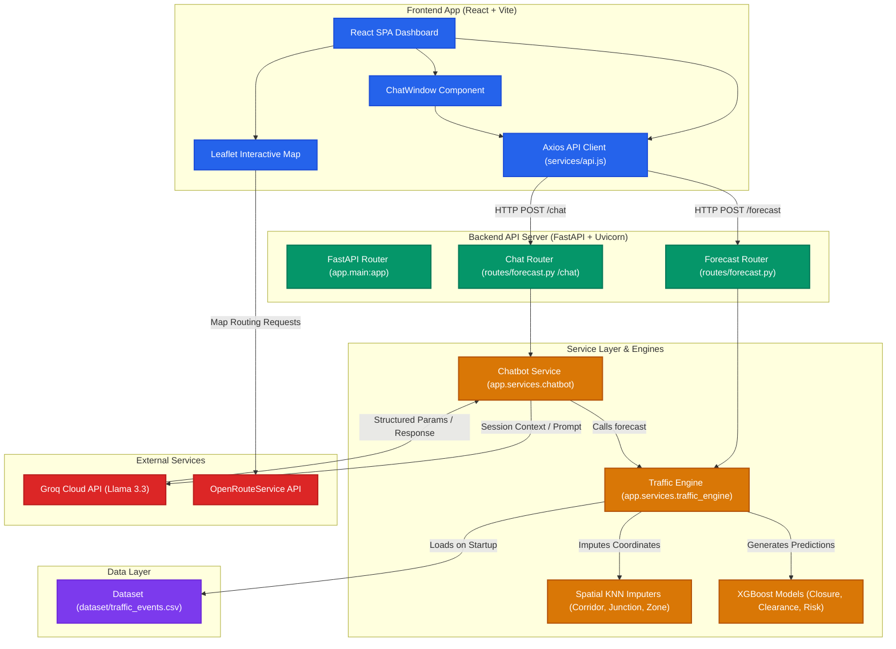

# 🌐 Urban Traffic Digital Twin & Intelligence System

Welcome to the **Urban Traffic Digital Twin**, an advanced predictive analytics and decision-support platform designed to model, simulate, and manage urban traffic congestion and events in Bengaluru. 

By leveraging historical incident data, machine learning predictive pipelines (XGBoost, LightGBM, Spatial KNN), and an AI-powered conversational chatbot assistant, this system acts as a digital twin to help municipal planners and traffic police predict bottlenecks, deploy resources, and plan routes dynamically.

---
## ✨ Features

### 1. 🔮 ML Predictive Forecasting Engine

* **Risk Classifier (XGBoost):** Classifies forecasted congestion severity into `Low`, `Medium`, `High`, and `Critical` categories.
* **Road Closure Probability Model:** Estimates the likelihood that an event will require partial or complete road closure.
* **Clearance Time Predictor:** Predicts the expected duration required for traffic conditions to return to normal.
* **Spatial Intelligence Engine (KNN):** Automatically resolves missing corridor, junction, and zone information using geographic coordinates.
* **Resource Optimization Engine:** Recommends officer deployment, barricade allocation, and diversion planning based on forecast severity.

### 2. 🗺️ Interactive Live Digital Twin Map

* **Visual Hotspots:** Interactive Leaflet-based map visualizing critical corridors, junctions, and event epicenters.
* **Corridor Impact Propagation:** Models traffic spillover effects across neighboring corridors.
* **Affected Corridor Visualization:** Highlights predicted traffic impact zones and congestion spread.
* **Diversion Recommendations:** Suggests alternative routes dynamically based on forecast severity.
* **Geospatial Intelligence Layer:** Displays corridor, junction, and zone-level risk insights.

### 3. 🎯 Traffic Command Center

* **City-Wide Risk Monitoring:** Monitor high-risk corridors, junctions, and traffic hotspots.
* **Operational Decision Support:** Provides actionable recommendations for traffic authorities.
* **Resource Planning Dashboard:** Forecasts officer requirements, barricade deployment, and diversion strategies.
* **Historical Traffic Intelligence:** Analyze peak congestion periods, frequently impacted locations, and event trends.
* **Command-Level Analytics:** Unified operational dashboard for planning, forecasting, and incident response.

### 4. 📈 Event Impact Timeline

* **Congestion Evolution Tracking:** Visualizes how traffic disruption evolves over time.
* **Incident Lifecycle Monitoring:** Tracks progression from incident formation to recovery.
* **Network Propagation Analysis:** Shows how congestion spreads through the road network.
* **Temporal Forecasting:** Helps operators anticipate escalation and peak congestion stages.

Timeline Stages:

* Incident Formation
* Queue Growth
* Secondary Corridor Impact
* Network Propagation
* Peak Congestion Stage
* Recovery Phase

### 5. ▶️ Digital Twin Replay Engine

* **Traffic Replay Simulation:** Replay traffic propagation minute-by-minute.
* **Interactive Timeline Controls:** Play, pause, scrub, and adjust replay speed.
* **Corridor Activation Tracking:** Visualize when affected corridors become congested.
* **Propagation Visualization:** Observe traffic spread across the transportation network.
* **Scenario Analysis:** Compare different event configurations and traffic outcomes.

### 6. 💬 AI Traffic Assistant Chatbot

* **Llama 3.3 Powered:** Natural language conversational assistant integrated through the Groq API.
* **Event Extractor:** Converts user queries into structured forecasting parameters automatically.
* **Forecast Interpretation:** Explains congestion scores, delays, and resource recommendations.
* **Historical Queries:** Answers questions about traffic hotspots, peak hours, and historical event impacts.
* **Strategic Planning Assistant:** Supports resource prioritization and operational decision-making.

### 7. 📄 PDF Report Generation

* Generates professional PDF reports containing:

  * Forecast summaries
  * Risk assessments
  * Resource allocation plans
  * Diversion strategies
  * Corridor impact analysis
  * Traffic intelligence insights

### 8. 📱 Android Mobile Application

* **Mobile Traffic Dashboard:** Access forecasts and traffic intelligence on the go.
* **AI Chat Assistant:** Interact with the forecasting engine through natural language.
* **Event Simulation:** Create and analyze traffic scenarios directly from mobile devices.
* **Command Center Access:** View operational recommendations and resource plans.
* **APK Distribution:** Android APK included for rapid deployment and field testing.

---

## 🏛️ System Architecture

* **Frontend:** React, Vite, Tailwind CSS, Leaflet Maps, Framer Motion, Axios.
* **Backend:** FastAPI, Python, Scikit-learn, XGBoost, LightGBM, Uvicorn, python-dotenv.
* **AI Layer:** Llama 3.3 (Groq API), Traffic Intelligence Assistant.
* **ML Layer:** XGBoost Models, Spatial KNN Models.
* **Data Layer:** Historical Bengaluru Traffic Events Dataset, Corridor Risk Database, Junction Risk Database, Zone Risk Database.


### 📐 Architecture Diagram



---

## 🚀 Getting Started

### Prerequisites
* **Node.js** (v18 or higher recommended)
* **Python** (v3.10 to v3.13)
* **Groq API Key** (obtainable from [Groq Console](https://console.groq.com/))
* **OpenRouteService API Key** (optional, for map routing, obtainable from [OpenRouteService](https://openrouteservice.org/))

---

### 📥 1. Backend Setup & Run

The backend API handles model training on startup, coordinates simulations, and runs the LLM chatbot service.

1. **Navigate to the Backend Directory:**
   ```bash
   cd backend
   ```

2. **Create a Python Virtual Environment:**
   ```bash
   python -m venv .venv
   ```

3. **Activate the Virtual Environment:**
   * **macOS/Linux:**
     ```bash
     source .venv/bin/activate
     ```
   * **Windows:**
     ```bash
     .venv\Scripts\activate
     ```

4. **Install Dependencies:**
   ```bash
   pip install -r requirements.txt
   ```
   > [!NOTE]
   > For macOS Apple Silicon users, `libomp` (OpenMP) is dynamically loaded by the application for XGBoost compatibility. Ensure your environment compiles scikit-learn/xgboost properly.

5. **Configure Environment Variables:**
   Create a `.env` file in the `backend/` directory:
   ```env
   GROQ_API_KEY=your_groq_api_key_here
   ```

6. **Start the FastAPI Server:**
   ```bash
   uvicorn app.main:app --reload
   ```
   The backend API will start at `http://127.0.0.1:8000`.

---

### 🎨 2. Frontend Setup & Run

The React frontend presents a visual digital twin dashboard and the conversational assistant window.

1. **Navigate to the Frontend Directory:**
   ```bash
   cd frontend-redesign_V2
   ```

2. **Install Dependencies:**
   ```bash
   npm install
   ```

3. **Configure Environment Variables:**
   Create a `.env` file in the `frontend-redesign_V2/` directory:
   ```env
   VITE_ORS_API_KEY=your_openrouteservice_key_here
   VITE_API_BASE_URL=http://127.0.0.1:8000
   ```

4. **Start the Vite Development Server:**
   ```bash
   npm run dev
   ```
   The application will start at `http://localhost:5173`.

---

## 🛠️ Testing the Setup

You can verify the backend API endpoints directly:

* **Forecast Endpoint Test:**
  ```bash
  curl -X POST "http://127.0.0.1:8000/forecast" \
       -H "Content-Type: application/json" \
       -d '{"event_type":"protest","attendance":5000,"duration_hours":2,"corridor":"Mysore Road","junction":"MekhriCircle","road_closure":true,"start_hour":12}'
  ```

* **Chatbot Endpoint Test:**
  ```bash
  curl -X POST "http://127.0.0.1:8000/chat" \
       -H "Content-Type: application/json" \
       -d '{"message":"What happens if a political rally with 15000 people starts at 6 PM on Bellary Road?"}'
  ```

