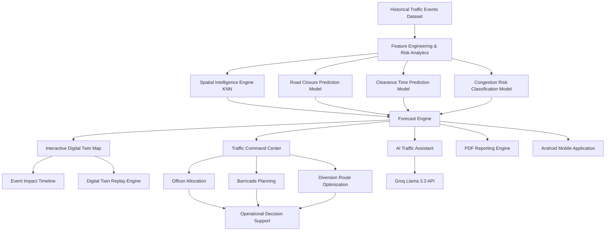

## ✨ Features

### 1. 🔮 ML Predictive Forecasting Engine

* **Risk Classifier (XGBoost):** Classifies forecasted congestion severity into `Low`, `Medium`, `High`, and `Critical` categories.
* **Road Closure Probability Model:** Estimates the likelihood that an event will require partial or complete road closure.
* **Clearance Time Predictor:** Predicts the expected duration required for traffic conditions to return to normal.
* **Spatial Intelligence Engine (KNN):** Automatically resolves missing corridor, junction, and zone information using geographic coordinates.
* **Resource Optimization Engine:** Recommends officer deployment, barricade allocation, and diversion planning based on forecast severity.

### 2. 🗺️ Interactive Live Digital Twin Map

* **Visual Hotspots:** Interactive Leaflet-based map visualizing critical corridors, junctions, and event epicenters.
* **Corridor Impact Propagation:** Models traffic spillover effects across neighboring corridors.
* **Affected Corridor Visualization:** Highlights predicted traffic impact zones and congestion spread.
* **Diversion Recommendations:** Suggests alternative routes dynamically based on forecast severity.
* **Geospatial Intelligence Layer:** Displays corridor, junction, and zone-level risk insights.

### 3. 🎯 Traffic Command Center

* **City-Wide Risk Monitoring:** Monitor high-risk corridors, junctions, and traffic hotspots.
* **Operational Decision Support:** Provides actionable recommendations for traffic authorities.
* **Resource Planning Dashboard:** Forecasts officer requirements, barricade deployment, and diversion strategies.
* **Historical Traffic Intelligence:** Analyze peak congestion periods, frequently impacted locations, and event trends.
* **Command-Level Analytics:** Unified operational dashboard for planning, forecasting, and incident response.

### 4. 📈 Event Impact Timeline

* **Congestion Evolution Tracking:** Visualizes how traffic disruption evolves over time.
* **Incident Lifecycle Monitoring:** Tracks progression from incident formation to recovery.
* **Network Propagation Analysis:** Shows how congestion spreads through the road network.
* **Temporal Forecasting:** Helps operators anticipate escalation and peak congestion stages.

Timeline Stages:

* Incident Formation
* Queue Growth
* Secondary Corridor Impact
* Network Propagation
* Peak Congestion Stage
* Recovery Phase

### 5. ▶️ Digital Twin Replay Engine

* **Traffic Replay Simulation:** Replay traffic propagation minute-by-minute.
* **Interactive Timeline Controls:** Play, pause, scrub, and adjust replay speed.
* **Corridor Activation Tracking:** Visualize when affected corridors become congested.
* **Propagation Visualization:** Observe traffic spread across the transportation network.
* **Scenario Analysis:** Compare different event configurations and traffic outcomes.

### 6. 💬 AI Traffic Assistant Chatbot

* **Llama 3.3 Powered:** Natural language conversational assistant integrated through the Groq API.
* **Event Extractor:** Converts user queries into structured forecasting parameters automatically.
* **Forecast Interpretation:** Explains congestion scores, delays, and resource recommendations.
* **Historical Queries:** Answers questions about traffic hotspots, peak hours, and historical event impacts.
* **Strategic Planning Assistant:** Supports resource prioritization and operational decision-making.

### 7. 📄 PDF Report Generation

* Generates professional PDF reports containing:

  * Forecast summaries
  * Risk assessments
  * Resource allocation plans
  * Diversion strategies
  * Corridor impact analysis
  * Traffic intelligence insights

### 8. 📱 Android Mobile Application

* **Mobile Traffic Dashboard:** Access forecasts and traffic intelligence on the go.
* **AI Chat Assistant:** Interact with the forecasting engine through natural language.
* **Event Simulation:** Create and analyze traffic scenarios directly from mobile devices.
* **Command Center Access:** View operational recommendations and resource plans.
* **APK Distribution:** Android APK included for rapid deployment and field testing.

---

## 🏛️ System Architecture

* **Frontend:** React, Vite, Tailwind CSS, Leaflet Maps, Framer Motion, Axios.
* **Backend:** FastAPI, Python, Scikit-learn, XGBoost, LightGBM, Uvicorn, python-dotenv.
* **AI Layer:** Llama 3.3 (Groq API), Traffic Intelligence Assistant.
* **ML Layer:** XGBoost Models, Spatial KNN Models.
* **Data Layer:** Historical Bengaluru Traffic Events Dataset, Corridor Risk Database, Junction Risk Database, Zone Risk Database.

### 📐 Architecture Diagram

